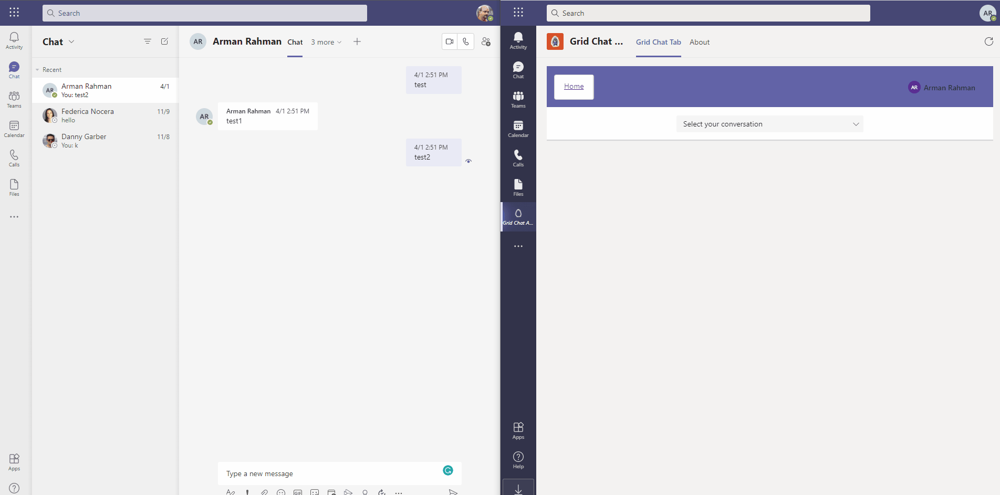

# Grid Chat Demo

## How to Setup

1. Run `cp .env.template .env` to create your own env variables

1. Setup [ngrok](https://ngrok.com/) for tunneling

    - Run `ngrok http 3000` and copy the hostname to `REACT_APP_HOSTNAME` in your .env file

1. Register your app in Azure Active Directory

    1. Go to [Azure Portal](https://portal.azure.com), then **Azure Active Directory > App Registration** and select **New Registration**.

    1. Fill the details to register an app:
        * give a name to your application
        * select **Accounts in any organizational directory** as an access level
        * place **auth-popup-url** as the redirect url `https://xxxxxxxxxxxx.ngrok.io/auth.html`
        * select **Register**
    
    1. Go to **Authentication** tab and enable **Implicit grant** by selecting `Access tokens` and `ID tokens`

    1. Go to **API permissions** tab, select **Add a permission > Microsoft Graph > Delegated permissions** and add `User.Read`, `People.Read`, `User.ReadBasic.All`, `Chat.ReadBasic`, `Chat.Read`, `Chat.ReadWrite`
    1. Then, select **Grant admin consent**.
    1. Go to **Overview** tab and copy **Application (client) ID** and add it to your .env file as `REACT_APP_CLIENT_ID`
    1. Go to **Certificates & Secrets** and create a new Client Secret. Then copy the secret to your .env file as `CLIENT_SECRET`

1. Fill out the rest of the .env variables

1. Run `yarn install`

1. Run `gulp manifest` to create the teams app manifest zip file under `./manifest/package`. You will upload this in teams to install your app.

1. Run `yarn run start` to start the server and client

## Demo

